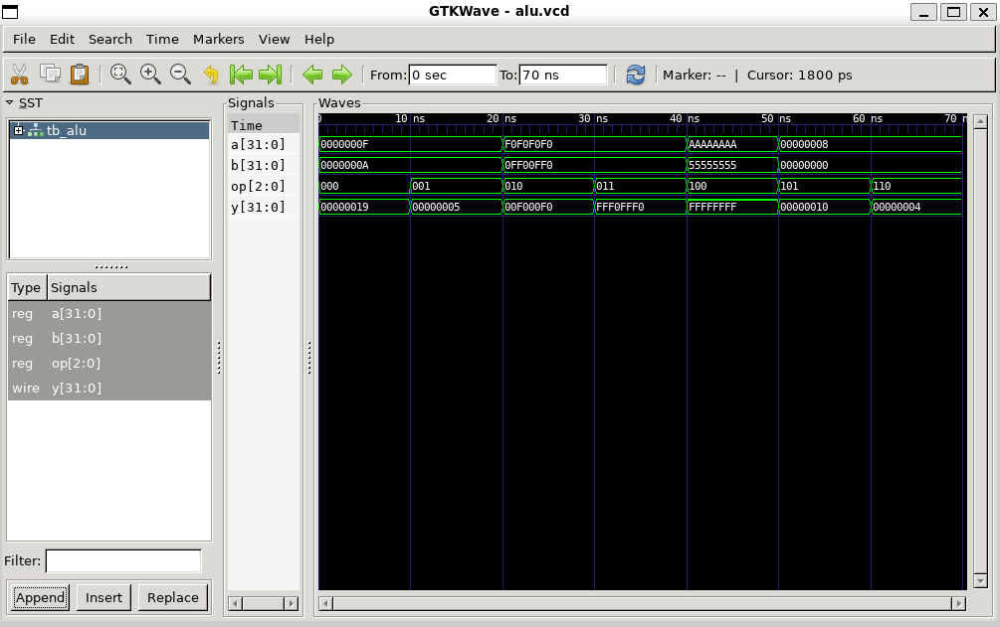

# RTL-to-GDSII Flow Exploration using Yosys and OpenROAD

## Overview
This project explores the early digital ASIC implementation flow using open-source EDA tools. A 32-bit combinational ALU written in Verilog is used as the reference design to demonstrate how RTL moves through verification, synthesis, gate-level netlist generation, and backend flow study.

The emphasis of this project is on building practical understanding of the transition from RTL design to gate-level implementation and physical-design flow stages.

---

## Design Description
The design implemented in this project is a 32-bit combinational ALU supporting:

- Addition
- Subtraction
- Bitwise AND
- Bitwise OR
- Bitwise XOR
- Shift left
- Shift right

---

## Flow Covered

1. RTL design in Verilog
2. Functional verification using Icarus Verilog
3. Waveform inspection using GTKWave
4. Logic synthesis using Yosys
5. Gate-level netlist generation
6. Schematic inspection of synthesized logic
7. Study of downstream OpenROAD-based physical design stages:
   - floorplanning
   - placement
   - routing
   - timing analysis
   - GDSII generation flow

---

## Tools Used

- Verilog HDL
- Icarus Verilog
- GTKWave
- Yosys
- OpenROAD Flow Scripts
- KLayout

---

## Repository Structure

- `rtl/` – RTL design and testbench
- `scripts/` – synthesis script
- `reports/` – synthesis outputs and netlist
- `docs/` – project notes
- `screenshots/` – waveform and schematic proof

---

## Synthesis Results

Generated artifacts:
- `reports/alu_netlist.v`
- `reports/synthesis_report.txt`

Key synthesis observations:
- RTL arithmetic and logic operations were transformed into a combinational gate-level netlist
- No latches or memories were inferred
- The resulting logic network demonstrates how compact RTL expands significantly after synthesis

---

## What This Project Demonstrates

- Practical RTL verification workflow
- Verilog-to-gate-level synthesis using Yosys
- Interpretation of synthesis statistics and generated netlists
- Awareness of how synthesized RTL proceeds into backend physical-design flow stages
- Understanding of the broader RTL-to-GDSII methodology used in ASIC design

---

## Visual Artifacts

### Functional Waveform

### Synthesized Logic Schematic

---

## Important Scope Note

This project demonstrates RTL verification, synthesis, and backend flow exploration. It does **not** claim full routed GDSII generation in the current repository state.

---

## Future Improvements

- Run a fully configured OpenROAD implementation flow with PDK support
- Generate floorplan / placement / routing reports
- Capture timing and area reports from a backend run
- Extend the exploration to a sequential design block

---

## Quantitative Results (Yosys Synthesis)

- Total cells: ~646
- Total wires: ~618
- Wire bits: ~713

### Observations
- Purely combinational design (no latches/memory inferred)
- Arithmetic operations expanded into complex gate structures
- Significant growth from compact RTL to gate-level netlist

---

## RTL to GDSII Flow Understanding

This project explores how RTL transitions into physical implementation:

1. **RTL Design**
   - Behavioral Verilog description of logic

2. **Synthesis (Yosys)**
   - Converts RTL → gate-level netlist
   - Maps logic to standard cells

3. **Floorplanning (conceptual)**
   - Defines chip area and layout regions

4. **Placement (conceptual)**
   - Positions standard cells physically

5. **Routing (conceptual)**
   - Connects placed cells using metal layers

6. **Timing Analysis**
   - Ensures design meets timing constraints

7. **GDSII Generation**
   - Final layout for fabrication

---

## Key Highlight
This project demonstrates practical understanding of how RTL designs are transformed into gate-level implementations and prepared for backend physical design in modern ASIC workflows.

